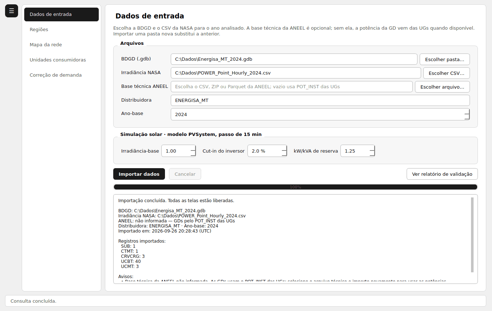
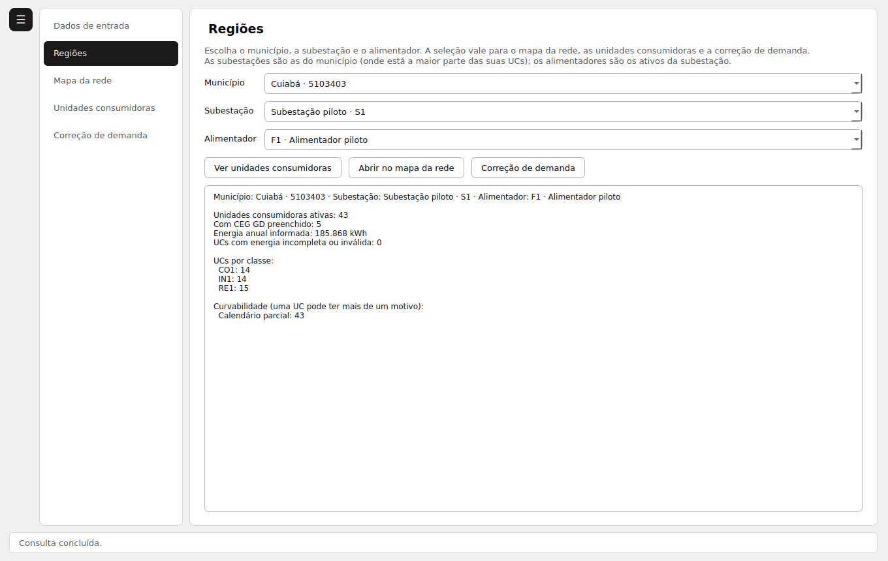
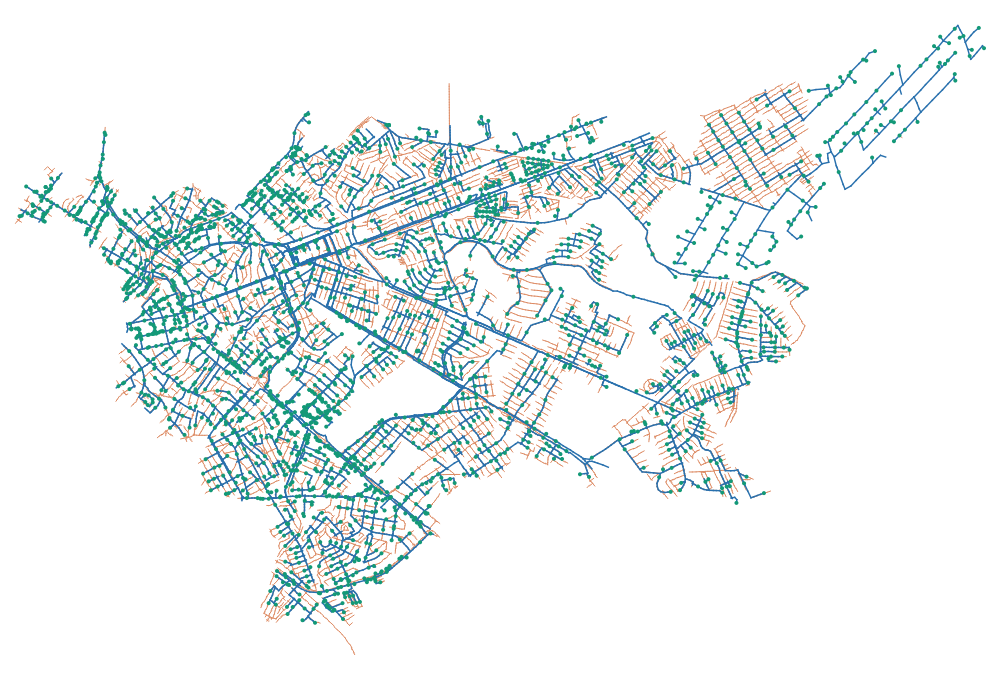
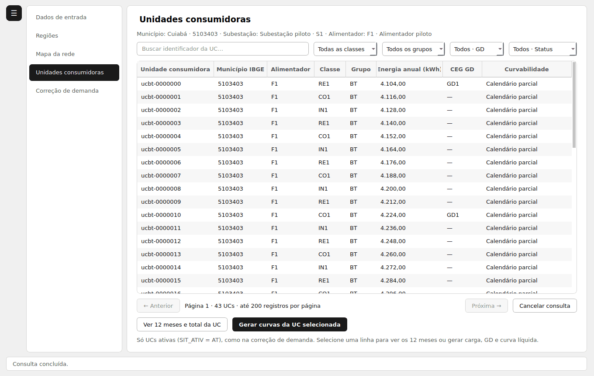

# CurvaGD

**Curvas de carga e de geração distribuída (GD) das unidades consumidoras da BDGD, com correção da demanda máxima mês a mês.**

O CurvaGD é um programa para Windows que lê a **BDGD** (Base de Dados Geográfica da Distribuidora, publicada pela ANEEL) e, para cada unidade consumidora (UC):

- reconstrói a curva de carga do ano inteiro, em passos de 15 minutos, a partir da energia mensal e das tipologias de carga (`CRVCRG`);
- simula a geração fotovoltaica das UCs com GD usando a irradiância horária da **NASA POWER**;
- calcula a **demanda máxima de cada mês** (`DEM_MAX_01..12`) que reproduz exatamente a energia registrada na BDGD.

Funciona offline e não precisa de instalação. Foi desenvolvido como Trabalho de Conclusão de Curso (TCC).

---

## Sumário

1. [Download](#1-download)
2. [Arquivos de que você vai precisar](#2-arquivos-de-que-você-vai-precisar)
3. [Como usar, passo a passo](#3-como-usar-passo-a-passo)
4. [Onde ficam os dados](#4-onde-ficam-os-dados)
5. [Como o cálculo é feito](#5-como-o-cálculo-é-feito)
6. [Problemas comuns](#6-problemas-comuns)
7. [Rodar pelo código-fonte (desenvolvedores)](#7-rodar-pelo-código-fonte-desenvolvedores)
8. [Licença e autoria](#8-licença-e-autoria)

---

## 1. Download

**[Baixar o CurvaGD.exe](https://github.com/abnerdiasalmeida3-a11y/CurvaGD/releases/latest/download/CurvaGD.exe)** (Windows 10 ou 11, 64 bits, cerca de 170 MB)

Todas as versões ficam na página [Releases](https://github.com/abnerdiasalmeida3-a11y/CurvaGD/releases).

- Não precisa instalar nada: é um arquivo único. Salve-o numa pasta e dê dois cliques.
- A primeira abertura pode levar alguns segundos, porque o programa se descompacta.
- O executável não é assinado digitalmente. Por isso, na primeira vez o Windows pode mostrar a tela **"O Windows protegeu o computador"**. Clique em **Mais informações** e depois em **Executar assim mesmo**.

---

## 2. Arquivos de que você vai precisar

O CurvaGD **não inclui nenhuma base de dados**. Baixe os arquivos abaixo antes de começar:

| Arquivo | Obrigatório? | Onde conseguir |
|---|---|---|
| **BDGD da distribuidora** (pasta `.gdb`) | Sim | [Portal de Dados Abertos da ANEEL – BDGD](https://dadosabertos.aneel.gov.br/dataset/base-de-dados-geografica-da-distribuidora-bdgd). Baixe o arquivo da sua distribuidora e do ano desejado e descompacte. O que o programa pede é a **pasta** cujo nome termina em `.gdb`. |
| **Irradiância horária da NASA POWER** (CSV) | Sim | [NASA POWER – Data Access Viewer](https://power.larc.nasa.gov/data-access-viewer/). Escolha o ponto da sua região, resolução **Hourly**, o parâmetro **All Sky Surface Shortwave Downward Irradiance** (`ALLSKY_SFC_SW_DWN`), formato **CSV** e o ano inteiro. |
| **Base técnica de GD fotovoltaica da ANEEL** (CSV, ZIP ou Parquet) | Não, mas recomendada | [Relação de empreendimentos de Geração Distribuída](https://dadosabertos.aneel.gov.br/dataset/relacao-de-empreendimentos-de-geracao-distribuida), recurso de informações técnicas fotovoltaicas (`empreendimento-gd-informacoes-tecnicas-fotovoltaica`). Ela traz a potência dos módulos e dos inversores de cada GD. |

**Atalho para o CSV da NASA.** Você também pode baixar o arquivo direto pelo navegador, trocando latitude, longitude e ano no endereço abaixo (o exemplo é Cuiabá, 2024):

```text
https://power.larc.nasa.gov/api/temporal/hourly/point?parameters=ALLSKY_SFC_SW_DWN&community=RE&latitude=-15.5929&longitude=-56.0925&start=20240101&end=20241231&format=CSV&time-standard=LST
```

O CSV precisa cobrir o ano-base escolhido no programa. Se a base da ANEEL não for informada, o programa usa a potência `POT_INST` das unidades geradoras (UGBT/UGMT) da própria BDGD. As UCs que ficarem sem potência de geração aparecem identificadas no resultado.

---

## 3. Como usar, passo a passo

O menu fica à esquerda. O botão **☰** (ou **Ctrl+B**) esconde e mostra o menu. Só a primeira tela fica liberada até você importar os dados.

### Passo 1 – Dados de entrada



1. Em **BDGD (.gdb)**, clique em **Escolher pasta…** e selecione a pasta `.gdb`.
2. Em **Irradiância NASA**, clique em **Escolher CSV…** e selecione o CSV da NASA POWER.
3. Em **Base técnica ANEEL**, se tiver, selecione o arquivo da ANEEL. Pode deixar vazio.
4. Confira a **Distribuidora** e o **Ano-base** (o programa sugere o ano pelo nome da BDGD).
5. Se quiser, ajuste os parâmetros da simulação solar: irradiância-base (padrão 1,0), cut-in do inversor (padrão 2%) e relação kW/kVA de reserva (padrão 1,25). Eles valem para todas as telas.
6. Clique em **Importar dados** e aguarde a barra chegar a 100%. O resumo da importação aparece embaixo; **Ver relatório de validação** mostra os detalhes.

> Não há histórico de importações: importar uma BDGD nova substitui a anterior e apaga os arquivos da importação antiga.

### Passo 2 – Regiões



Escolha o **município**, a **subestação** e o **alimentador**. Essa seleção vale para o mapa, para a lista de UCs e para a correção de demanda.

- Cada subestação pertence ao município onde está a maior parte das suas UCs ativas.
- Só aparecem alimentadores ativos (com pelo menos uma UC ativa).
- O quadro de resumo mostra o total de UCs ativas, quantas têm GD, a energia anual e as UCs por classe.

### Passo 3 – Mapa da rede

Desenha os trechos de média (MT) e baixa tensão (BT) da subestação escolhida, lidos do `.gdb` importado.



### Passo 4 – Unidades consumidoras



1. A tabela mostra só as UCs ativas (`SIT_ATIV = AT`) da região. Use a busca e os filtros (classe, grupo, GD, status) para achar uma UC.
2. **Ver 12 meses e total da UC** mostra a energia de cada mês.
3. Selecione uma linha e clique em **Gerar curvas da UC selecionada**. Escolha o mês (ou o ano completo). Numa UC com GD, as potências dos módulos e do inversor vêm da base da ANEEL e podem ser editadas.
4. A janela de resultado tem uma aba para cada curva: carga sem GD, geração da GD, curva líquida (carga menos GD), importação da rede, exportação para a rede, autoconsumo, irradiância, todas juntas e curvas típicas por tipo de dia. Use a roda do mouse para zoom e arraste para selecionar um período.
5. **Exportar curvas em CSV…** grava todas as séries.

### Passo 5 – Correção de demanda

Mostra os alimentadores da região. Se você escolheu um alimentador em Regiões, as UCs dele já entram carregadas.

- **Aba Demanda**
  - **Carregar UCs**: lê as UCs ativas do alimentador, somando as linhas da mesma UC.
  - **Calcular demandas**: preenche `DEM_MAX_01..12` de cada UC. Com **Incluir diagnóstico**, mostra também a energia importada conferida e a exportada.
  - **Exportar CSV/XLSX**: grava a tabela de demandas.
  - **Exportar curva do recorte**: grava a carga em kW das UCs selecionadas no período escolhido.
  - **Curva do alimentador**: mostra a curva por fase (A, B, C e total), os indicadores de desequilíbrio e o relatório de atribuição de fases.
- **Aba Estatísticas**: perfil de classes e de ligações (mono, bi e trifásicas) dos alimentadores da região. Um duplo clique leva o alimentador para a aba Demanda.
- **Sobre o método**: explica a conta e as convenções usadas.

---

## 4. Onde ficam os dados

- Os arquivos que você escolhe **não são alterados** nem enviados para a internet.
- A importação, os caches e os tratamentos salvos ficam numa pasta de dados do seu usuário no Windows, dentro de `%LOCALAPPDATA%\CurvaGD`. Para liberar espaço, basta apagar essa pasta com o programa fechado.
- As exportações (CSV/XLSX) são gravadas onde você escolher.

---

## 5. Como o cálculo é feito

A lista de UCs e a correção de demanda usam a mesma função de geração (`app/calculo/gd.py`), o mesmo passo de 15 minutos e a mesma irradiância.

1. **Curva de carga da UC** (`app/calculo/curvas.py`). Os perfis DU, SA e DO da `CRVCRG` são aplicados pelo dia da semana: segunda a sexta usam DU, sábado usa SA e domingo usa DO. Como a CRVCRG não tem perfil de feriado, um feriado usa o perfil do seu dia da semana. A curva do ano é normalizada pelo máximo do ano, de modo que a `DEM_MAX` de um mês é exatamente o pico daquele mês.
2. **Geração da GD** (`app/calculo/gd.py`). O modelo `PVSystem` (o mesmo do OpenDSS, calculado de forma vetorizada com NumPy) usa a curva potência × temperatura, a eficiência do inversor, o cut-in de 2% e o limite de kVA. A irradiância da NASA (`ALLSKY_SFC_SW_DWN`) é convertida para kW/m² e reamostrada de 1 hora para 15 minutos por interpolação PCHIP sobre a energia acumulada.
3. **Potências da GD** (`app/calculo/potencias.py`), nesta ordem de prioridade:
   - a base técnica de GD fotovoltaica da ANEEL, somando todas as linhas do mesmo CEG GD;
   - o `POT_INST` das UGBT/UGMT, somado por CEG GD e usado como kVA do inversor. A potência dos módulos sai da relação de 1,25 kW/kVA. O valor passa pelo teto legal (75 kW em BT e 5 MW em MT), com conversão de W para kW quando necessário;
   - se nenhuma das duas existir, a UC é tratada como sem geração.
4. **Demanda máxima mensal** (`app/calculo/motor.py`). Para cada mês, calcula-se a `DEM_MAX` que reproduz a energia `ENE` da UC como energia importada da rede:

   ```text
   ENE_mês = h · Σ max(DEM_MAX · C − G, 0)
   ```

   onde `C` é a curva de carga em pu, `G` é a geração em kW e `h` é o passo em horas. Sem GD, a conta é direta: `DEM_MAX = ENE / (h · ΣC)`. Com GD, a função é linear por partes e é invertida de forma exata. Um `ENE` ausente, inválido ou negativo resulta em demanda zero no mês.

**Validação.** Comparado com a ferramenta CORRECAO_DEMANDA_BDGD usando as mesmas curvas, irradiância e potências, a `DEM_MAX` dos 12 meses é idêntica UC a UC.

**Limitações.** Os resultados são estimativas feitas a partir dos dados declarados na BDGD, não medições. A qualidade depende da BDGD (energias, tipologias e cadastro das UGs), da representatividade do ponto escolhido na NASA POWER e do cadastro da ANEEL.

---

## 6. Problemas comuns

| Situação | O que fazer |
|---|---|
| O Windows bloqueou o programa | Clique em **Mais informações → Executar assim mesmo** (veja a seção [Download](#1-download)). |
| As telas do menu estão cinza | Elas só são liberadas depois de **Importar dados** na tela Dados de entrada. |
| Erro dizendo que o CSV não tem o ano | O CSV da NASA precisa cobrir o ano-base escolhido. Baixe o ano correto. |
| Erro de colunas no CSV da NASA | Confira se o arquivo é **horário** (Hourly) e contém `ALLSKY_SFC_SW_DWN`. |
| UCs com GD aparecem "sem potência" | A GD não foi encontrada na base da ANEEL nem nas UGs da BDGD. Informe a base técnica da ANEEL ou digite as potências na janela de curvas da UC. |
| O programa não abre | Ele mostra uma janela com o erro. Anote a mensagem e abra uma [issue](https://github.com/abnerdiasalmeida3-a11y/CurvaGD/issues) com ela. |

---

## 7. Rodar pelo código-fonte (desenvolvedores)

Requisitos: **Python 3.12 (64 bits)** e Git. O executável é só para Windows, mas o código também roda em Linux.

```powershell
git clone https://github.com/abnerdiasalmeida3-a11y/CurvaGD.git
cd CurvaGD
py -3.12 -m venv .venv
.\.venv\Scripts\python.exe -m pip install -r requirements.lock
.\.venv\Scripts\python.exe main.py
```

Também dá para abrir com dois cliques em **`Abrir pelo codigo-fonte.cmd`**, que usa a pasta `workspace` dentro do repositório.

**Gerar o executável**

Execute **`Gerar executavel.cmd`**. Ele compila com o PyInstaller a partir de `CurvaGD.spec` e copia o `CurvaGD.exe` para a pasta **acima** do repositório.

**Estrutura das pastas**

```text
CurvaGD/
├── app/
│   ├── calculo/      cálculo da carga, da geração e da demanda máxima
│   ├── correcao/     módulos da correção de demanda: BDGD, ANEEL, demanda, fases, estatísticas
│   ├── config/       esquemas de importação, calendários e municípios IBGE
│   ├── core/         erros, cancelamento e logs
│   ├── data/         catálogo DuckDB, UCs, regiões e tratamentos salvos
│   ├── domain/       estruturas de dados, calendário e curvas típicas
│   ├── ingest/       importação da BDGD (.gdb ou CSV)
│   ├── services/     casos de uso: dados de entrada, curvas, exportação, mapa
│   └── ui/           janelas e gráficos (PySide6)
├── imagens/          imagens deste guia
├── main.py           ponto de entrada
├── CurvaGD.spec      receita do PyInstaller
└── requirements.lock versões exatas das dependências
```

Principais bibliotecas: PySide6 (interface e gráficos), DuckDB e PyArrow (armazenamento), pyogrio/GDAL (leitura do `.gdb`), NumPy, pandas e SciPy (cálculo), holidays (feriados).

---

## 8. Licença e autoria

Desenvolvido por **Abner Dias Almeida** como Trabalho de Conclusão de Curso.

Distribuído sob a [licença MIT](LICENSE): você pode usar, copiar, modificar e redistribuir, desde que mantenha o aviso de copyright.

Encontrou um erro ou tem uma sugestão? Abra uma [issue](https://github.com/abnerdiasalmeida3-a11y/CurvaGD/issues).
